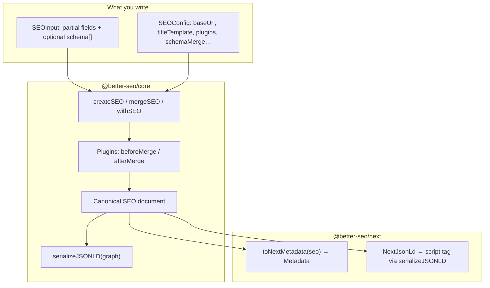
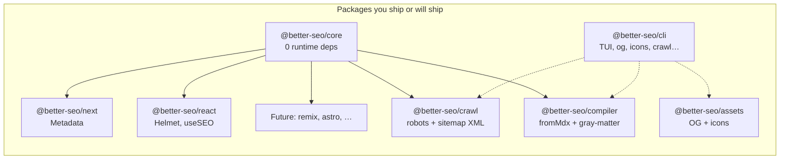

# better-seo.js

[](https://0xmilord.github.io/better-seo-js/)
[](./LICENSE)
[](https://nodejs.org/)
[](https://www.typescriptlang.org/)
[](./packages/core/README.md)
[](./SECURITY_COMPLETE_SUMMARY.md)
[](./PACKAGE.md)

**CI & quality**

[](https://github.com/0xMilord/better-seo-js/actions/workflows/ci.yml)
[](https://github.com/0xMilord/better-seo-js/actions/workflows/commitlint.yml)
[](https://github.com/0xMilord/better-seo-js/actions/workflows/security.yml)
[](https://github.com/0xMilord/better-seo-js/actions/workflows/release.yml)

**Tests & coverage**

[](https://vitest.dev/)
[](./examples/nextjs-app)
[](./packages/core/README.md#coverage)
[](./packages/next/README.md#coverage)
[](./packages/better-seo-assets/README.md#coverage)
[](./packages/better-seo-cli/README.md#coverage)
[](./packages/react/README.md)
[](./packages/better-seo-crawl/)
[](./packages/better-seo-compiler/)

### CI and test results (badges, tables, reports)

Workflow badges use GitHub's **`/actions/workflows/<file>.yml/badge.svg`** URLs, so they update automatically after each run on **`main`**. Coverage badges are **live**; they are generated by GitHub Actions committing JSON badge data to `badges/` in the repo, which Shields.io renders dynamically — **zero external services or signups required**. **`npm run test:coverage`** enforces per-package thresholds in CI, and **`lcov.info`** files are uploaded as workflow artifacts ([`ci.yml`](./.github/workflows/ci.yml)).

| What                      | How                                                                        | Where to look                                                                                                                                                        |
| ------------------------- | -------------------------------------------------------------------------- | -------------------------------------------------------------------------------------------------------------------------------------------------------------------- |
| **Unit tests + coverage** | Vitest (V8), `npm run test:coverage` in each workspace that defines it     | Logs under [CI → quality job](https://github.com/0xMilord/better-seo-js/actions/workflows/ci.yml); artifact **`coverage`** (e.g. `packages/core/coverage/lcov.info`) |
| **Lint, types, format**   | ESLint, `tsc`, Prettier via `npm run check`                                | Same [CI workflow](https://github.com/0xMilord/better-seo-js/actions/workflows/ci.yml)                                                                               |
| **E2E**                   | Playwright, `npm run test:e2e` (`examples/nextjs-app`, Vite React example) | Same workflow after browser install                                                                                                                                  |
| **Size budget**           | `npm run size` (`@better-seo/core`)                                        | Final step in [CI](https://github.com/0xMilord/better-seo-js/actions/workflows/ci.yml)                                                                               |
| **Conventional commits**  | commitlint                                                                 | [commitlint workflow](https://github.com/0xMilord/better-seo-js/actions/workflows/commitlint.yml)                                                                    |
| **Security scans**        | npm audit + scheduled workflow                                             | [security workflow](https://github.com/0xMilord/better-seo-js/actions/workflows/security.yml) + CI **security** job                                                  |

**Quick links:** [all workflow runs](https://github.com/0xMilord/better-seo-js/actions) · [CI (`ci.yml`)](https://github.com/0xMilord/better-seo-js/actions/workflows/ci.yml) · [releases (`release.yml`)](https://github.com/0xMilord/better-seo-js/actions/workflows/release.yml)

**One place to describe how a page should look to Google, social apps, and structured-data consumers—then map that description to your framework without inventing five parallel sources of truth.**

This repo is a **monorepo**: the published **`@better-seo/core`** package is the brain (pure data + rules). **`@better-seo/next`** and **`@better-seo/react`** translate that model to **Next.js `Metadata`** and **react-helmet-async**. **`@better-seo/compiler`** adds optional **gray-matter** frontmatter → **`SEOInput`** for content sites. Heavy work (OG/icons, **robots/sitemap** builders, CLIs) stays in optional packages so your Edge bundle never pays for it.

### Wave status (snapshot)

Shipping focus follows the internal roadmap; this table matches **[`internal-docs/PROGRESS.md`](./internal-docs/PROGRESS.md)** (maintainers: update both in the same PR when waves move).

| Waves (group)    | Theme                                                        | Status (Apr 2026)                                                                                                                                                                                              |
| ---------------- | ------------------------------------------------------------ | -------------------------------------------------------------------------------------------------------------------------------------------------------------------------------------------------------------- |
| **1, 4**         | Core + Next + E2E, distribution                              | **Done** — `createSEO`, `mergeSEO`, `withSEO`, `validateSEO`, rules, **`serializeJSONLD`**, **`@better-seo/next`**, Playwright **`nextjs-app`**, **size-limit**, Changesets, **`docs/compare`**                |
| **2–3**          | OG + icons                                                   | **Done** — **`@better-seo/assets`**, CLI **`og`** / **`icons`**, recipes                                                                                                                                       |
| **5**            | React + validation depth                                     | **Done** — **`@better-seo/react`** (Helmet, **`useSEO`**, **`SEOProvider`**), **`renderTags`** parity, golden Next metadata tests, **`react-seo-vite`** E2E                                                    |
| **9** (partial)  | Operations CLI                                               | **Partial** — **interactive `better-seo` TUI** (Clack); CLI **`crawl robots` / `crawl sitemap`**; **`doctor`**, **`init`**, **`migrate`** hints — industry **templates** / **`template switch`** not built yet |
| **12** (partial) | Crawl + migrate                                              | **Partial** — **`@better-seo/crawl`** (`renderRobotsTxt`, `renderSitemapXml`, …) + CLI wrappers; RSS / codemod **`migrate`** TBD                                                                               |
| **6–8, 10–11**   | Rules scale, compiler, snapshot/preview, scan/fix, design OG | **Not started or early** — see PROGRESS                                                                                                                                                                        |

Public guides: **[`docs/`](./docs/index.md)** (including **Nextra site** in **`apps/docs`**) · **[`docs/recipes/`](./docs/recipes/index.md)** · **[`docs/commands.md`](./docs/commands.md)** (CLI + TUI) · **[`docs/adapters/future-frameworks.md`](./docs/adapters/future-frameworks.md)** (Remix / Astro / Nuxt — future).

---

<p align="center">
  <a href="https://0xmilord.github.io/better-seo-js/"><strong>📖 Documentation</strong></a> ·
  <a href="./docs/recipes/index.md"><strong>Recipes</strong></a> ·
  <a href="./apps/docs/README.md"><strong>Docs site dev</strong></a> ·
  <a href="./docs/commands.md"><strong>CLI commands</strong></a> ·
  <a href="./CONTRIBUTING.md"><strong>Contributing</strong></a>
</p>

> **Tags:** `seo` · `metadata` · `open-graph` · `json-ld` · `nextjs` · `app-router` · `schema.org` · `structured-data` · `zero-dependency` · `typescript`

---

## In one minute

You describe a page with a small, typed object: title, description, canonical URL, Open Graph hints, Twitter card, and an array of JSON-LD nodes (WebPage, Article, FAQ, custom graphs—your choice). Core turns that into a **canonical `SEO` document**: merged, normalized, ready to serialize.

For **Next.js App Router**, the adapter turns that document into **`Metadata`** for `export const metadata` or `generateMetadata`, and gives you a ready-made **`NextJsonLd`** component so JSON-LD goes through the same **`serializeJSONLD`** path as everything else—not a hand-built string hiding in a template.

```bash
npm install @better-seo/core @better-seo/next
```

Minimal page (copy-paste friendly):

```tsx
// app/page.tsx
import { NextJsonLd } from "@better-seo/next/json-ld"
import { prepareNextSeo } from "@better-seo/next"
import { webPage } from "@better-seo/core"

const site = process.env.NEXT_PUBLIC_SITE_URL ?? "http://localhost:3000"

const { metadata, seo } = prepareNextSeo(
  {
    title: "Example",
    description: "One pipeline for head tags and JSON-LD.",
    canonical: "/",
    schema: [webPage({ name: "Example", description: "Demo.", url: site })],
  },
  { baseUrl: site },
)

export { metadata }

export default function Page() {
  return (
    <main>
      <NextJsonLd seo={seo} />
      <h1>Example</h1>
    </main>
  )
}
```

Even shorter, when you only need metadata and no JSON-LD in the tree:

```ts
import { seo } from "@better-seo/next"

export const metadata = seo({ title: "Hello", description: "World" })
```

A full runnable App Router demo with **Playwright** checks lives in **`examples/nextjs-app`** (`/` and **`/with-seo`** for layout→page merging).

### Optional: OG image generation (Wave 2)

The core stays free of OG renderers. Install **`@better-seo/assets`** in Node/build scripts and call **`generateOG`**, or use **`@better-seo/cli`**:

```bash
npx @better-seo/cli og "Hello World" -o ./og.png --site-name "My site"
```

In a **TTY**, **`npx better-seo`** with no subcommand opens an **interactive menu** (OG, icons, doctor, init, crawl hints). Set **`CI=true`**, **`BETTER_SEO_CI=1`**, **`BETTER_SEO_NO_TUI=1`**, or pass **`--no-interactive`** / **`-y`** before a subcommand to keep output non-interactive.

Built-in **light** and **dark** card templates; **1200×630** PNG. Custom cards: pass **`--template ./my-og.mjs`** (compiled ESM module; props = **`OgCardProps`** from **`@better-seo/assets`**). See **`docs/recipes/og-wave2.md`**.

### Visual proof: assets before → after (Wave 4)

| Surface             | Before                                | After (CLI / library)                                                                                                                                              |
| ------------------- | ------------------------------------- | ------------------------------------------------------------------------------------------------------------------------------------------------------------------ |
| **Open Graph**      | Missing or generic preview card       | **`npx @better-seo/cli og "Title" -o ./public/og.png`** → **1200×630** PNG                                                                                         |
| **Favicon / PWA**   | Single `favicon` or hand-copied sizes | **`npx @better-seo/cli icons ./logo.svg -o ./public`** → `favicon.ico`, **16–512** PNGs, **`apple-touch-icon`**, **`maskable-icon`**, optional **`manifest.json`** |
| **Next.js example** | Meta pointed at missing static files  | **`examples/nextjs-app`** runs **`npm run assets`** on **`predev` / `prebuild`** (see that README); E2E fetches **`/og-example.png`** and **`/favicon.ico`**.      |

This repo stays **headless**: we do not ship raster screenshots in git; run the commands above (or open **`examples/nextjs-app`**) to see real output locally or in CI.

---

## Why this shape isn’t arbitrary

SEO work splits naturally into three layers:

1. **Meaning** — what should crawlers and previews infer? (title, description, canonical, hreflang, robots, OG/Twitter, JSON-LD graph.)
2. **Transport** — how does that meaning reach HTML? (Next `Metadata`, `<meta>`, `<script type="application/ld+json">`, or vanilla tag descriptors.)
3. **Operations** — assets, migrations, crawling, CI “doctor” commands. Important, but not something every serverless function should import.

Most teams accidentally merge (2) and (3) into their React tree. **better-seo** keeps (1) in **`@better-seo/core`** with **zero runtime npm dependencies**, pushes (2) into **small adapter packages** that depend on your framework as **their** peers, and leaves (3) to optional packages and CLIs that can use Node APIs freely.

That is how you keep **Edge** and **browser** bundles honest: the core never opens **`fs`**, never reads **`package.json`** at runtime, and never pulls in OG renderers “just because they’re convenient.”

---

## Mental model: from input to HTML



**Layered routes (layout + page):** build a **parent** `SEO` with `createSEO`, then merge child-specific input with **`mergeSEO`** or use **`withSEO`** from the Next package to jump straight to **`Metadata`**. Whatever you pass to **`NextJsonLd`** should be the **same merged `SEO`** you used for metadata, so `<title>` and JSON-LD never disagree. Pass the **same `SEOConfig`** into merges when you use **`titleTemplate`**—templates apply during `createSEO`, not inside the stored `SEO` object.

---

## Monorepo map (what lives where)



| Location                           | Role                                                                                                                                                                                             |
| ---------------------------------- | ------------------------------------------------------------------------------------------------------------------------------------------------------------------------------------------------ |
| **`packages/core`**                | npm **`@better-seo/core`** — overview **[`packages/core/README.md`](./packages/core/README.md)**                                                                                                 |
| **`packages/next`**                | **`@better-seo/next`** — overview **[`packages/next/README.md`](./packages/next/README.md)**                                                                                                     |
| **`packages/react`**               | **`@better-seo/react`** — **[`packages/react/README.md`](./packages/react/README.md)** (Wave 5, **Helmet** + **`useSEO`**)                                                                       |
| **`examples/nextjs-app`**          | Production-shaped **App Router** app; **Playwright** tests guard the golden path.                                                                                                                |
| **`examples/react-seo-vite`**      | **Vite + React** + **`BetterSEOHelmet`**; **Playwright** checks document title / meta.                                                                                                           |
| **`packages/better-seo-assets`**   | npm **`@better-seo/assets`** — **[`packages/better-seo-assets/README.md`](./packages/better-seo-assets/README.md)**                                                                              |
| **`packages/better-seo-cli`**      | npm **`@better-seo/cli`** — TUI launcher, **`og`**, **`icons`**, **`crawl`**, **`doctor`**, **`init`**, **`migrate`** — **[README](./packages/better-seo-cli/README.md)**                        |
| **`packages/better-seo-crawl`**    | npm **`@better-seo/crawl`** — robots, sitemap, RSS, Atom, llms, sitemap-index — use from CLI, recipes, or build scripts                                                                          |
| **`packages/better-seo-compiler`** | npm **`@better-seo/compiler`** — **`fromMdx`** (frontmatter + **`fromContent`**) — **[README](./packages/better-seo-compiler/README.md)** · **[`docs/api/compiler.md`](./docs/api/compiler.md)** |
| **`examples/vanilla-render-tags`** | **`createSEO` + `renderTags`** in plain Node (**no React**).                                                                                                                                     |
| **`docs/`** / **`apps/docs`**      | Canonical docs markdown + Nextra site (getting started, concepts, API, recipes).                                                                                                                 |
| **`internal-docs/`** (clone only)  | Maintainer specs: PRD, architecture, features, roadmap — index in **CONTRIBUTING.md** (not part of published docs site).                                                                         |

Dependency rule: **adapters always depend on core; core never depends on adapters.** If you only need JSON-LD in a non-Next stack, you can consume **`@better-seo/core`** and feed `serializeJSONLD` yourself—no Next required.

---

## Core concepts (plain language)

**`SEO` document**  
The normalized output of `createSEO`. Everything downstream reads this shape: meta (title, description, canonical, robots, hreflang map), Open Graph, Twitter card, and `schema` (JSON-LD nodes).

**`SEOInput`**  
The partial object you pass in. You can use top-level `title` / `description` / `canonical` or nest some fields under `meta`; core flattens the conventions for you.

**`SEOConfig`**  
Per-call options: `baseUrl` (turns relative canonicals into absolute URLs), `titleTemplate` (e.g. `%s | Brand`), `plugins`, `schemaMerge: { dedupeByIdAndType: true }` (last wins when the same `@id` + `@type` appears twice), and more over time.

**Single JSON-LD path**  
All structured data that leaves the library for a `<script type="application/ld+json">` tag should go through **`serializeJSONLD`**. Adapters should not concatenate ad hoc JSON strings— that is how you get quoting bugs and XSS-adjacent foot-guns in HTML.

**`SEOError`**  
Typed errors with stable **`code`** values (`VALIDATION`, `ADAPTER_NOT_FOUND`, `USE_SEO_NOT_AVAILABLE`, `USE_SEO_NO_PROVIDER`). Use **`isSEOError`** from **`@better-seo/core`**; full install and error notes for contributors are in **CONTRIBUTING.md**.

---

## Next.js: the pieces you actually import

| You need                           | Import from                                                                                                         |
| ---------------------------------- | ------------------------------------------------------------------------------------------------------------------- |
| One-shot **`Metadata`**            | `@better-seo/next` → **`seo(input, config?)`**                                                                      |
| **`Metadata` + `SEO` for JSON-LD** | **`prepareNextSeo`**                                                                                                |
| Layered metadata                   | **`withSEO(parent, child, config?)`** — use the **same `config`** as `createSEO` if you rely on **`titleTemplate`** |
| JSON-LD in JSX                     | **`@better-seo/next/json-ld`** → **`NextJsonLd`**                                                                   |
| Low-level mapping                  | **`toNextMetadata`** from `@better-seo/next` (tests and advanced use)                                               |

**`useSEO`:** implemented in **`@better-seo/react`** behind **`SEOProvider`**. For **App Router**, prefer **`metadata` / `generateMetadata`** and **`prepareNextSeo`**; use the React stack for **SPAs** (see **[`docs/recipes/react-wave5.md`](./docs/recipes/react-wave5.md)**).

---

## JSON-LD helpers

Core ships small builders—**`webPage`**, **`article`**, **`techArticle`**, **`organization`**, **`person`**, **`product`**, **`breadcrumbList`**, **`faqPage`**—plus **`customSchema`** for escape hatches. Each helper sets `@context` and `@type` correctly so your graph is boring and predictable.

---

## Development & quality (this repo)

From the repository root:

```bash
npm run check    # build, format, lint, typecheck, unit coverage
npm run ci       # check + Playwright e2e + core size-limit
```

### CI pipelines ([`.github/workflows`](./.github/workflows))

| Workflow                                                   | When it runs        | What it gates                                                                                                                                                                                                        |
| ---------------------------------------------------------- | ------------------- | -------------------------------------------------------------------------------------------------------------------------------------------------------------------------------------------------------------------- |
| **[`ci.yml`](./.github/workflows/ci.yml)**                 | PR + push to `main` | `npm audit` (artifact), **`npm run check`** (build, format, lint, typecheck, **Vitest + coverage thresholds**), Playwright **`nextjs-app`** + **`react-seo-vite-example`**, **`npm run size`** on `@better-seo/core` |
| **[`commitlint.yml`](./.github/workflows/commitlint.yml)** | Pull requests       | Conventional Commits on every commit in the PR                                                                                                                                                                       |
| **[`security.yml`](./.github/workflows/security.yml)**     | Push to `main`      | Security / supply-chain checks (see workflow)                                                                                                                                                                        |
| **[`release.yml`](./.github/workflows/release.yml)**       | Maintainers         | Changesets versioning / publish when configured                                                                                                                                                                      |

Coverage **LCov** is uploaded from **`@better-seo/core`** and **`@better-seo/next`** as CI artifacts (`coverage`); thresholds are enforced in each package’s **`vitest.config.ts`** (see per-package READMEs below).

### Package test & coverage targets

| Package                  | README                                                                 | Unit tests          | Coverage focus (minimum lines / branches)  |
| ------------------------ | ---------------------------------------------------------------------- | ------------------- | ------------------------------------------ |
| **`@better-seo/core`**   | [`packages/core`](./packages/core/README.md)                           | Vitest              | **90%** / **80%** (see package README)     |
| **`@better-seo/next`**   | [`packages/next`](./packages/next/README.md)                           | Vitest              | **82%** / **72%** on `to-next-metadata.ts` |
| **`@better-seo/assets`** | [`packages/better-seo-assets`](./packages/better-seo-assets/README.md) | Vitest              | **85%** / **75%**                          |
| **`@better-seo/cli`**    | [`packages/better-seo-cli`](./packages/better-seo-cli/README.md)       | Vitest + bin smoke  | **80%** / **65%**                          |
| **`@better-seo/react`**  | [`packages/react`](./packages/react/README.md)                         | Vitest (jsdom, RTL) | **85%** / **75%**                          |

Core has a **size budget** (see **`packages/core/package.json`** and `npm run size`). E2E: **`examples/nextjs-app/e2e`**, **`examples/react-seo-vite/e2e`**.

---

## Documentation index

| Doc                                                                                      | Purpose                                      |
| ---------------------------------------------------------------------------------------- | -------------------------------------------- |
| **[`docs/index.md`](./docs/index.md)**                                                   | Docs hub (markdown source for the site)      |
| **[`apps/docs/README.md`](./apps/docs/README.md)**                                       | Nextra docs app — `npm run dev` (port 3004)  |
| **[`docs/recipes/index.md`](./docs/recipes/index.md)**                                   | Next/React patterns and tutorials            |
| **[`docs/commands.md`](./docs/commands.md)**                                             | **`@better-seo/cli`** command reference      |
| **[`docs/compare/next-seo-vs-better-seo.md`](./docs/compare/next-seo-vs-better-seo.md)** | Comparison with next-seo                     |
| **[`docs/adapters/future-frameworks.md`](./docs/adapters/future-frameworks.md)**         | Planned adapters (Remix, Astro, Nuxt, …)     |
| **[`CONTRIBUTING.md`](./CONTRIBUTING.md)**                                               | Dev setup; maintainer `internal-docs/` index |
| **[`PACKAGE.md`](./PACKAGE.md)**                                                         | Releases, Changesets, publishing             |

---

## Contributing & license

See **[`CONTRIBUTING.md`](./CONTRIBUTING.md)** and **[`SECURITY.md`](./SECURITY.md)**.  
Licensed under **MIT** — **[`LICENSE`](./LICENSE)**.

---

**Summary:** treat **`@better-seo/core`** as the source of truth for SEO _meaning_, let adapters handle framework _transport_, and keep heavy operational tooling out of the hot path. That is the whole trick—and it stays “plug and play” because **`prepareNextSeo`** and **`seo`** give you a working Next integration in a handful of lines without locking you out of merges, plugins, or structured data later.
