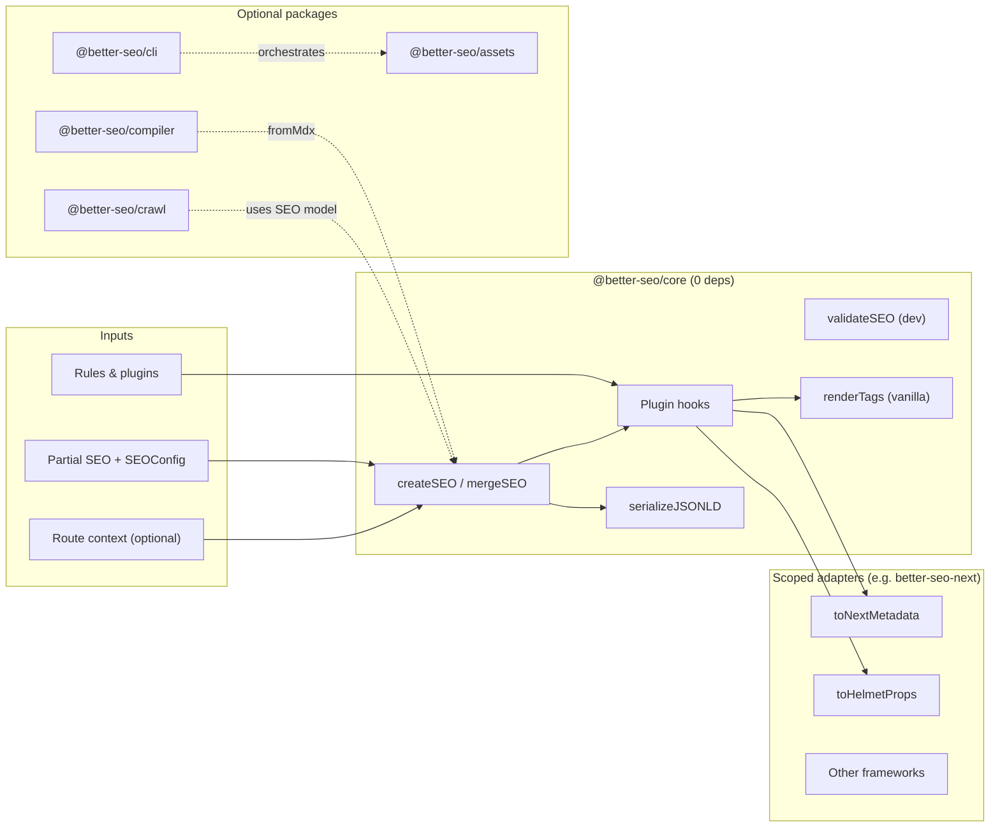

# better-seo.js — Technical Architecture

This document describes **how the system is built and bounded**. Product intent, adoption strategy, and roadmap live in [`PRD.md`](./PRD.md). Feature inventory: [`FEATURES.md`](./FEATURES.md). **Sequencing / waves:** [`Roadmap.md`](./Roadmap.md).

**Naming:** the zero-dependency **core** npm package is **`@better-seo/core`**. Additional **`@better-seo/*`** packages are **adapters**, **assets**, **CLI**, or other optional surfaces—core does not depend on them at runtime.

---

## 1. Goals & constraints

| Goal                                | Architectural implication                                                                                                                                                                                                                        |
| ----------------------------------- | ------------------------------------------------------------------------------------------------------------------------------------------------------------------------------------------------------------------------------------------------ |
| **Zero-dependency core**            | The published **`@better-seo/core`** package has **no `dependencies`** (and no **`peerDependencies` required at install** for core). Only **standard library–style** TypeScript/JavaScript: pure data transforms, serializers, small registries. |
| **Small browser/Edge-safe surface** | Anything that reads **`package.json`**, scans the filesystem, or shells out lives in **CLI** or **optional packages**, never in code paths imported by Edge bundles.                                                                             |
| **Framework power**                 | Framework-specific behavior sits in **`@better-seo/*` adapters** that depend on **core** and (optionally) on framework packages as **their** `peerDependencies`.                                                                                 |
| **Enterprise correctness**          | JSON-LD and tags go through **one serialization path**; merging is **deterministic**; config can be **request-scoped** (`createSEOContext`) instead of global.                                                                                   |

**“Zero dependency” means:** no runtime npm packages shipped inside **`@better-seo/core`**. Dev-time tools (TypeScript, Vitest, build bundlers) are **`devDependencies` of the repo**, not of the consumer’s runtime graph for `import "@better-seo/core"`.

---

## 2. System overview



Scoped packages use npm names like `@better-seo/next`. Those strings are omitted from the diagram because **`@` and `/*` inside `subgraph … […]` labels break Mermaid** (parsed as link / comment syntax).

**Pipeline (logical):**

```txt
Partial<SEO> + SEOConfig
  → apply rules (optional, needs route string)
  → createSEO (normalize + fallbacks)
  → run plugins (beforeMerge / afterMerge)
  → SEO (canonical document)
  → Adapter.render(seo) → framework metadata | Helmet props | TagDescriptor[]
```

---

## 3. Package topology (monorepo)

| Package                                                                  | Role                                                                                                                          | Runtime deps (target)                                                          |
| ------------------------------------------------------------------------ | ----------------------------------------------------------------------------------------------------------------------------- | ------------------------------------------------------------------------------ |
| **`@better-seo/core`**                                                   | Normalized model, merge, schema helpers, vanilla `renderTags`, serialization, validation (dev-flagged), registry, context API | **None**                                                                       |
| **`@better-seo/next`**                                                   | Next.js `Metadata` / `generateMetadata` mapping                                                                               | **`@better-seo/core` + `next` as peer**                                        |
| **`@better-seo/react`**                                                  | React Helmet / head props                                                                                                     | **peers: `@better-seo/core`, `react`, `react-helmet-async`** (exact peers TBD) |
| **`@better-seo/remix`**, **`@better-seo/astro`**, **`@better-seo/nuxt`** | Same pattern: thin mapping + peers                                                                                            | Framework peers only                                                           |
| **`@better-seo/assets`**                                                 | OG (Satori, etc.), Sharp-based icons — **heavy**                                                                              | Own deps OK; **not** imported by core                                          |
| **`@better-seo/cli`**                                                    | **`og`**, **`icons`**, **`doctor`**, **`init`**, **`migrate`** (hints) + assets                                               | CLI deps OK; **not** imported by core                                          |
| **`@better-seo/compiler`**                                               | **`fromMdx`** — **gray-matter** frontmatter + body → **`SEOInput`** (body inference delegates to core **`fromContent`**)      | **`@better-seo/core`** + **`gray-matter`**; **not** imported by core           |
| **`@better-seo/crawl`**                                                  | Robots / sitemap / syndication XML builders + URL hint helper                                                                 | **`@better-seo/core`** only                                                    |

**Rule:** `@better-seo/core` MUST NOT import from `@better-seo/next`, `@better-seo/assets`, or `@better-seo/cli`. The dependency arrow is **always toward core**.

---

## 4. Core module layout (reference)

```
packages/core/    # npm: @better-seo/core
├── src/
│   ├── types.ts           # SEO, SEOConfig, JSONLD, JSONLDValue, ValidationConfig, …
│   ├── core.ts            # createSEO, mergeSEO, applyFallbacks, titleTemplate
│   ├── schema.ts          # WebPage, Article, … CustomSchema
│   ├── serialize.ts       # serializeJSONLD (HTML-safe JSON for script tags)
│   ├── render.ts          # renderTags → TagDescriptor[] (vanilla)
│   ├── validate.ts        # validateSEO (no-op or tree-shaken in prod builds when configured)
│   ├── adapters/
│   │   └── registry.ts    # registerAdapter, getAdapter, default vanilla adapter
│   ├── plugins.ts         # defineSEOPlugin, runHooks
│   ├── context.ts         # createSEOContext (closure over config + plugins + rules)
│   ├── singleton.ts       # initSEO, getGlobalConfig (Node-oriented; document limitations)
│   ├── voila.ts           # seo(), thin orchestration → create + adapter
│   ├── rules.ts           # applyRules (pure: glob + route string)
│   ├── migrate.ts         # fromNextSeo (next-seo-shaped props → SEOInput)
│   ├── node.ts            # optional entry: package.json / env inference (Node builtins)
│   └── index.ts           # public exports only
├── package.json           # "dependencies": {}
└── README.md
```

**Optional split (if MDX/compiler would violate zero-dep):**

- Keep **`fromContent(title, bodyText)`** in core (string in / `SEO` out; no parsers).
- Move **`fromMDX`** behind **`@better-seo/compiler`** or **`better-seo/compiler`** subpath with **optional peers** (`mdx-bundler`, `gray-matter`, etc.) so default **`npm install @better-seo/core`** stays dependency-free.

Exact choice is an implementation detail; **ARCHITECTURE.md** requires: **default core install = zero third-party runtime modules**.

---

## 5. The `SEO` document model

The **`SEO`** type is the **single source of truth** after `createSEO`:

- **`meta`**: title (required after normalize), description, canonical, robots, alternates, pagination, verification.
- **`openGraph`**, **`twitter`**: social surfaces; filled from fallbacks where omitted.
- **`schema`**: `JSONLD[]` with strict **`JSONLDValue`** (no `any` in public typings).

**Invariants (core should enforce or document):**

- After `createSEO`, `meta.title` is a non-empty string (or adapters reject).
- Canonical URLs: core may emit **relative + absolute** depending on config; adapters map to framework expectations.
- **`schema`** nodes MUST include `@context` and `@type` before serialization (helpers guarantee this).

---

## 6. Merge semantics (summary)

`mergeSEO(parent, child, config?)`:

- Scalars: child wins.
- `meta.alternates.languages`: deep merge.
- `openGraph.images`: replace array (child wins).
- `schema`: default concatenation order; optional **`dedupeByIdAndType`** per `SEOConfig.schemaMerge`.

Plugins may adjust **before** final merge steps (see §9).

---

## 7. Serialization & security

**Problem:** embedding user or CMS content in `application/ld+json` can break HTML (`</script>`, Unicode line separators).

**Core responsibility:**

- Expose **`serializeJSONLD(input: JSONLD | JSONLD[]): string`** that:
  - Uses **`JSON.stringify`** on the **entire** graph (never manual string assembly of user fields).
  - Optionally applies additional hardening if needed for legacy browsers (document in implementation).

**Adapter responsibility:**

- Produce framework-native fields (e.g. Next `other: { 'application/ld+json': [...] }` or equivalent) using **core output**, not duplicate logic.

**Anti-pattern:** `'<script>…' + JSON.stringify(partial)` mixed with raw user strings.

---

## 8. Adapter contract

Conceptually, an adapter is a **pure mapping** from **`SEO`** to a framework type:

```ts
// Conceptual — names may differ in implementation
export interface SEOAdapter<TOutput = unknown> {
  id: string
  /** Map normalized SEO → Next.Metadata, Helmet props, MetaFunction[], etc. */
  toFramework(seo: SEO): TOutput
}

export function registerAdapter(adapter: SEOAdapter): void
export function getAdapter(id: string): SEOAdapter | undefined
```

**`@better-seo/next`** provides:

- **`toNextMetadata(seo: SEO): Metadata`** (and helpers for `generateMetadata` async data if needed).
- **JSON-LD:** consumers use **`@better-seo/next/json-ld`** (`NextJsonLd`) so **`serializeJSONLD`** output lands in `<script type="application/ld+json">` without polluting static **`Metadata`** with non-serializable or `undefined`-heavy shapes.
- Registration: importing **`@better-seo/next`** runs **`registerAdapter("next")`** once (side effect); enterprise docs may still prefer explicit imports over auto-detect in CI.

**Vanilla / tests:**

- Core exposes **`renderTags(seo: SEO): TagDescriptor[]`** where each descriptor is `{ kind: 'meta' | 'link' | 'script-jsonld', … }` or similar stable shape for snapshots and non-React hosts.

---

## 9. Plugins & lifecycle

Plugins are **user-supplied** objects with stable **`id`** and optional hooks. They run **inside core** but are **registered via config/context** (not auto-loaded from disk).

| Hook           | Approximate point in pipeline                                                                                                   |
| -------------- | ------------------------------------------------------------------------------------------------------------------------------- |
| `beforeMerge`  | After rule merge accumulation, before final `createSEO` normalization (or between merge phases — finalize one ordering in code) |
| `afterMerge`   | On final `SEO` before adapter                                                                                                   |
| `onRenderTags` | Only on vanilla path / tag expansion                                                                                            |

**Properties:**

- Hooks MUST be **synchronous** unless we explicitly add async later; **Wave 1** should stay sync for predictability in `generateMetadata`.
- Plugins MUST NOT import Node-only APIs if they are meant to run on Edge; **that’s user responsibility** — core only invokes functions.

**Capability flags** (on `SEOConfig` or separate `features` object) let hosts disable JSON-LD, OG merge, etc., for staged rollout.

---

## 10. Configuration & inference

| Mode                           | Where config comes from        | Allowed mechanisms                                                                                                                                                            |
| ------------------------------ | ------------------------------ | ----------------------------------------------------------------------------------------------------------------------------------------------------------------------------- |
| **Explicit**                   | Caller passes `SEOConfig`      | Always allowed                                                                                                                                                                |
| **`createSEOContext(config)`** | Per request / per tenant       | **Required** on Edge & multi-tenant                                                                                                                                           |
| **`initSEO()` global**         | Process-wide default           | **Node only**; acceptable for quick start                                                                                                                                     |
| **Inference**                  | `package.json` / `process.env` | **`import "@better-seo/core/node"`** — `readPackageJsonForSEO` / `inferSEOConfigFromEnvAndPackageJson` / `initSEOFromPackageJson` (never import this entry from Edge bundles) |

**Build-time rule:** publish **multiple entry points** if needed:

- **`@better-seo/core`** — browser/Edge-safe subset (no `fs`, no `path` resolution of `package.json`).
- **`@better-seo/core/node`** — **published**: `readPackageJsonForSEO`, **`inferSEOConfigFromEnvAndPackageJson`**, **`initSEOFromPackageJson`** (still **zero npm deps**, Node builtins only).

If a single entry is preferred, **tree-shaking** + guarded lazy `require` is acceptable only if proven safe for Next Edge bundles (tests required).

---

## 11. Rules engine (`SEORule`)

**Pure** function:

`applyRules(route: string, rules: SEORule[]): Partial<SEO>`

- Match **`rule.match`** with documented glob semantics (e.g. `picomatch`-compatible patterns).
- **Implementation note:** to keep core dependency-free, ship a **minimal internal glob** or copy a small permissive implementation **in-repo** (license-compliant). **Alternatively**, accept only a **restricted pattern subset** (prefix/suffix) v1. Exact choice is implementation detail; **do not add `micromatch` as an npm dependency** without changing the dependency policy for core.

**Ordering:** merge matching rules in **ascending** `priority` so **higher numeric priority overwrites** earlier keys (tie-break: later rule in the array wins).

**Framework bridge:** **`getCurrentRouteFromAdapter()`** is **not** in core — adapters or app code pass **`routeContext.pathname`** into `seo()`.

---

## 12. Validation (`validateSEO`)

- **Default:** meaningful in **development** only (length hints, missing description warnings).
- **Production:** stripped or no-op via:
  - build defines (`import.meta.env.DEV`), or
  - separate export `@better-seo/core/dev`.

Must not pull in heavy deps; only comparisons on strings/arrays already in memory.

---

## 13. Runtime matrix

| Runtime                | Core usage                               | Inference | Adapter                                   |
| ---------------------- | ---------------------------------------- | --------- | ----------------------------------------- |
| **Node (Next server)** | Full                                     | Optional  | `@better-seo/next`                        |
| **Edge (middleware)**  | **`createSEOContext` + explicit config** | **Off**   | Same adapter if compatible with Edge APIs |
| **Browser**            | `createSEOContext` or static config      | **Off**   | `react` / client metadata patterns        |
| **Workers**            | Explicit config                          | **Off**   | Vanilla tags or framework worker support  |
| **CLI**                | N/A (uses Node)                          | Full      | N/A                                       |

---

## 14. CLI, assets, crawl (out-of-core)

These packages **may** depend on:

- **Filesystem**, **sharp**, **Satori**, **React** (for OG templates), etc.

They consume the **`SEO`** model and/or generated files but **must not** become transitive deps of `import "@better-seo/core"` in app code.

---

## 15. Testing architecture

| Layer                           | What proves                                                            |
| ------------------------------- | ---------------------------------------------------------------------- |
| **Unit (core)**                 | merge, fallbacks, schema helpers, serializeJSONLD safety, plugin order |
| **Adapter contract**            | golden fixtures: `SEO` snapshot → expected Next `Metadata` object      |
| **E2E (`examples/nextjs-app`)** | Real HTML head: OG tags, canonical, JSON-LD parseable                  |

**CI:** E2E gated on main / release branches per PRD.

---

## 16. Build & distribution

- **ESM-first**; **CJS** optional dual publish if required by consumers (document in `package.json` `exports`).
- **Types:** strict `declaration`; no `any` on public exports.
- **Size budget:** keep core **~5KB gzip** per PRD; audit with **`size-limit`** or equivalent in repo (dev tool).

---

## 17. Summary

1. **`@better-seo/core`** is a **dependency-free runtime library**: pure model + merge + serialize + registry + optional validation.
2. **Power** comes from **adapters** (framework output), **plugins** (policy), and **optional packages** (assets, CLI, crawl)—not from bloating core’s `node_modules`.
3. **Edge and enterprise** are first-class by **forbidding hidden fs/env inference** on those paths and promoting **`createSEOContext`**.
4. **Security-critical output** (JSON-LD) has **one serializer** used everywhere.

For **what** to build first, see **Wave 1** in [`PRD.md`](./PRD.md) §5.
